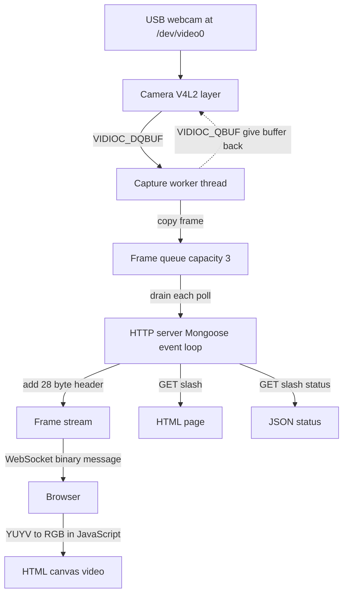

# legendary-chainsaw

A small, self contained C program that reads live video from a Linux camera and
shows it inside your web browser in real time. Builds and runs across all major
Linux distributions Debian, Ubuntu, Fedora, Arch, openSUSE, Alpine, and more
on x86-64 and ARM.

It grabs frames from a V4L2 camera (a normal USB webcam at `/dev/video0`), then
sends those frames to the browser over HTTP and WebSocket. The browser converts
the raw YUYV video into RGB with JavaScript and draws it on an HTML canvas. There
is no external player, no plugin, and no app to install on the viewing device.
Any modern browser can watch the stream.

Everything is plain C11. The only networking library it uses (Mongoose) is
already included inside the repository, so you never download it separately. The
whole web page is also baked into the program as a single string, so there are no
static files to serve or lose.

This README is long on purpose. It explains not just how to run the project, but
also how each part works, why it is built that way, and how to fix the common
problems you will hit on a fresh Linux machine.

---

## Table of Contents

1. [What this project is](#what-this-project-is)
2. [What you get](#what-you-get)
3. [Quick start (the short version)](#quick-start-the-short-version)
4. [How it works (flowchart)](#how-it-works-flowchart)
5. [System diagram (TikZ)](#system-diagram-tikz)
6. [The data path, step by step](#the-data-path-step-by-step)
7. [Dependencies](#dependencies)
8. [Install the dependencies (step by step, any Linux)](#install-the-dependencies-step-by-step-any-linux)
9. [Get the code](#get-the-code)
10. [Setup and build](#setup-and-build)
11. [Run it](#run-it)
12. [Important: bind address and configuration](#important-bind-address-and-configuration)
13. [Camera permissions](#camera-permissions)
14. [Firewall and ports](#firewall-and-ports)
15. [Open it in the browser](#open-it-in-the-browser)
16. [What the console prints](#what-the-console-prints)
17. [HTTP and WebSocket endpoints](#http-and-websocket-endpoints)
18. [Frame wire format](#frame-wire-format)
19. [YUYV to RGB conversion](#yuyv-to-rgb-conversion)
20. [Configuration values](#configuration-values)
21. [Project layout](#project-layout)
22. [Component reference](#component-reference)
23. [Threading and memory ownership](#threading-and-memory-ownership)
24. [Cross platform notes (Linux)](#cross-platform-notes-linux)
25. [Verify your build and run](#verify-your-build-and-run)
26. [Troubleshooting](#troubleshooting)
27. [Frequently asked questions](#frequently-asked-questions)
28. [Limitations and ideas for later](#limitations-and-ideas-for-later)
29. [License](#license)

---

## What this project is

The program runs on any Linux computer (x86-64 or ARM, glibc or musl) that has
a webcam attached. It does four jobs at the same time:

1. It talks to the camera using the Linux V4L2 API and pulls raw video frames.
2. It runs a background thread that keeps the camera busy and never lets the
   network side slow the camera down.
3. It runs a small web server (built on the Mongoose library) that serves a web
   page and accepts WebSocket connections.
4. It pushes each captured frame to the connected browser, which draws it on a
   canvas so you see live video.

It is meant as a clear, readable example of a full capture to browser pipeline in
pure C, with clean module boundaries. It is good for learning, for a LAN camera,
or as a starting point for a bigger project.

---

## What you get

- Native camera capture with V4L2. No OpenCV, no ffmpeg, no GStreamer.
- YUYV 4:2:2 video at 640x480, 30 FPS. The driver is allowed to adjust these.
- Memory mapped (MMAP) capture, so frames come straight from driver buffers.
- A dedicated capture thread, so the network loop never blocks on the camera.
- A small bounded frame queue that drops old frames if the client is slow. This
  gives clean back pressure instead of growing memory forever.
- A single self contained web page. No external files, no CDN, no build tools for
  the front end.
- A simple binary frame protocol with a 28 byte header and a magic number.
- Strict build flags: `-Wall -Wextra -Wpedantic` on C11.
- No third party download step. Mongoose is vendored inside the repo.
- Cross-platform Linux build. Works with glibc (Debian, Ubuntu, Fedora, Arch,
  openSUSE) and musl (Alpine). CC is overridable (`CC=clang make`).
- Configurable at runtime: bind address, port, and camera device can be set
  via command-line arguments or environment variables. No source edits needed.

---

## Quick start (the short version)

Works on Debian, Ubuntu, Fedora, Arch, openSUSE, Alpine, and any Linux with a
V4L2 camera.

**Debian / Ubuntu:**
```sh
sudo apt update && sudo apt install -y build-essential git v4l-utils
```

**Fedora:**
```sh
sudo dnf install -y gcc make git v4l-utils
```

**Arch:**
```sh
sudo pacman -S base-devel git v4l-utils
```

**Alpine:**
```sh
sudo apk add build-base git v4l-utils
```

Then clone and build:
```sh
git clone https://github.com/ccsalman545/legendary-chainsaw.git
cd legendary-chainsaw
make
./build/http_server
```

That is it. The server binds to `0.0.0.0:8080` by default.

Open `http://localhost:8080/` in your browser and click `Connect WebSocket`.

To use a different camera or port:
```sh
CAMERA_DEVICE=/dev/video1 ./build/http_server -p 9090
```

The rest of this document explains every step in full.

---

## How it works (flowchart)



Plain words version of the flow:

1. The camera layer opens `/dev/video0`, asks for YUYV 640x480 at 30 FPS, and
   maps 4 memory buffers into the program.
2. A worker thread keeps pulling filled frames from the driver, copies each one
   into a small queue, and gives the driver buffer back right away.
3. The server loop runs the network events, then empties the queue and pushes
   each frame to the connected browser.
4. Each frame goes out as one WebSocket binary message: a 28 byte header first,
   then the raw YUYV pixels.
5. The browser reads the header, converts YUYV to RGB, and paints the canvas.

---

## System diagram (TikZ)

If you build documentation with LaTeX, this TikZ block draws the same pipeline.
Compile it inside a document that loads `\usepackage{tikz}` and
`\usetikzlibrary{arrows.meta, positioning}`.

```latex
\begin{tikzpicture}[
    node distance = 12mm and 16mm,
    box/.style = {draw, rounded corners, align=center,
                  minimum width=38mm, minimum height=11mm, fill=gray!8},
    io/.style  = {draw, rounded corners, align=center,
                  minimum width=38mm, minimum height=11mm, fill=blue!8},
    lbl/.style = {font=\small},
    every edge/.style = {draw, -{Stealth}, thick}
]
    \node[io]  (cam)   {USB webcam \\ /dev/video0};
    \node[box] (v4l2)  [below=of cam]   {Camera V4L2 layer \\ MMAP buffers};
    \node[box] (work)  [below=of v4l2]  {Capture worker \\ pthread};
    \node[box] (queue) [below=of work]  {Frame queue \\ capacity 3};
    \node[box] (srv)   [below=of queue] {HTTP server \\ Mongoose loop};
    \node[box] (fs)    [below=of srv]   {Frame stream \\ 28 byte header};
    \node[io]  (br)    [below=of fs]    {Browser \\ YUYV to RGB canvas};

    \draw (cam)   edge (v4l2);
    \draw (v4l2)  edge node[lbl, right] {VIDIOC\_DQBUF} (work);
    \draw (work)  edge node[lbl, right] {copy frame} (queue);
    \draw (queue) edge node[lbl, right] {drain} (srv);
    \draw (srv)   edge (fs);
    \draw (fs)    edge node[lbl, right] {WebSocket binary} (br);

    \draw[-{Stealth}, thick, dashed]
        (work.west) to[bend left=55]
        node[lbl, left] {VIDIOC\_QBUF} (v4l2.west);
\end{tikzpicture}
```

---

## The data path, step by step

This is the same flow as above, but with the exact function names, so you can
follow it in the source.

1. `camera_capture()` waits on the camera file descriptor with `select()` for up
   to 2 seconds. When a frame is ready it calls `VIDIOC_DQBUF` to take a filled
   buffer out of the driver queue. It fills a `Frame` struct whose `data` pointer
   points straight into a driver MMAP buffer. No copy happens yet.
2. `CameraWorker` (running on its own thread) takes that `Frame` and calls
   `frame_queue_push()`, which does a `malloc` plus `memcpy` so the queue owns its
   own copy of the pixels.
3. Right after the copy, the worker calls `camera_release_frame()`, which returns
   the buffer to the driver with `VIDIOC_QBUF` so the camera can fill it again.
4. The server loop calls `mg_mgr_poll()` every 10 milliseconds to handle network
   events, then calls `http_send_frames()`, which pops every waiting frame from
   the queue.
5. For each popped frame, `frame_stream_send()` builds a 28 byte header, joins it
   with the pixel data into one buffer, and sends it with `mg_ws_send()` as a
   WebSocket binary message. The caller then frees the popped frame data.
6. In the browser, `ws.onmessage` receives the binary message, `processFrame()`
   validates the header, `yuyvToRgb()` converts the pixels, and the canvas is
   updated. A small on screen HUD shows frame count and FPS.

---

## Dependencies

You need these on the machine that has the camera and runs the server:

| Dependency | Why it is needed | Notes |
|---|---|---|
| Linux kernel with V4L2 | Talks to the camera | Present on every normal Linux distro |
| A UVC webcam (default `/dev/video0`) | The video source | Overridable via `CAMERA_DEVICE` env var |
| GCC or Clang | Compiles the C11 code | Override with `CC=clang make` |
| GNU Make | Runs the build | Standard build tool |
| pthread | Runs the capture thread | Part of the C library, linked with `-pthread` |
| Git | To clone the repo | Optional if you download a zip instead |
| A web browser | To view the video | On any machine that can reach the server |
| v4l-utils | Camera diagnostics | Optional, only used for troubleshooting |

The build system works with both glibc (Debian, Ubuntu, Fedora, Arch, openSUSE)
and musl libc (Alpine Linux). No distribution-specific patches are needed.

Mongoose (the HTTP and WebSocket library) is already inside
`third_party/mongoose`, so you do not install it. It is a single `.c` file and a
single `.h` file, compiled together with the rest of the project.

The viewing device (the phone, tablet, or PC that opens the web page) needs only
a browser. It does not need any of the build tools above.

---

## Install the dependencies (step by step, any Linux)

Pick the block that matches your distribution and run the commands in a terminal.
After that, jump to [Get the code](#get-the-code).

### Debian, Ubuntu, Linux Mint, Raspberry Pi OS, Pop OS

```sh
sudo apt update
sudo apt install -y build-essential git v4l-utils
```

`build-essential` installs GCC, Make, and the standard C headers in one package.

### Fedora, RHEL, CentOS Stream, Rocky Linux, AlmaLinux

```sh
sudo dnf install -y gcc make git v4l-utils
```

On very old CentOS 7 systems use `yum` instead of `dnf`.

### Arch Linux, Manjaro, EndeavourOS

```sh
sudo pacman -Syu --needed base-devel git v4l-utils
```

`base-devel` is a group that includes GCC and Make.

### openSUSE (Leap and Tumbleweed)

```sh
sudo zypper install -y gcc make git v4l-utils
```

### Alpine Linux

```sh
sudo apk add build-base git v4l-utils
```

`build-base` provides GCC, Make, and the C headers on Alpine.

### Void Linux

```sh
sudo xbps-install -Sy gcc make git v4l-utils
```

### Gentoo

```sh
sudo emerge --ask sys-devel/gcc sys-devel/make dev-vcs/git media-tv/v4l-utils
```

### Check that the tools are ready

Run these two commands. Both should print a version number.

```sh
gcc --version
make --version
```

If both print a version, your build tools are ready.

---

## Get the code

Clone with Git:

```sh
git clone https://github.com/ccsalman545/legendary-chainsaw.git
cd legendary-chainsaw
```

Or, if you do not use Git, download the repository zip from the project page,
unzip it, and `cd` into the folder.

---

## Setup and build

From the repository root, build the server:

```sh
make
```

This creates the program at `build/http_server`.

Clean the build later if you want a fresh start:

```sh
make clean
```

Useful targets:

| Command | What it does |
|---|---|
| `make` | Build `build/http_server` (this is the default) |
| `make http` | The same as `make` |
| `make clean` | Delete the `build/` folder |

Sources that are compiled into the server:

```text
src/http_main.c
src/http_server.c
src/frame_stream.c
src/frame_queue.c
src/camera_v4l2.c
src/camera_worker.c
third_party/mongoose/mongoose.c
```

Compiler flags used by the build:

```text
-std=c11 -D_DEFAULT_SOURCE -D_POSIX_C_SOURCE=200809L -Wall -Wextra -Wpedantic -O2
```

These flags mean the code is compiled as strict C11, with POSIX features turned
on, with all common warnings enabled, and with optimization level 2. A clean
build should finish with no errors.

If you prefer Clang, you can build with it too:

```sh
make CC=clang
```

---

## Run it

Make sure your camera is plugged in, then start the server:

```sh
./build/http_server
```

On start it will:

1. Open and configure `/dev/video0` (YUYV, 640x480, 30 FPS, 4 MMAP buffers).
2. Start the capture worker thread.
3. Start listening for HTTP connections.

To stop the server, press `Ctrl+C` in the terminal.

Before this works on a new machine, read the next two sections. Almost every
machine needs the bind address change, and many need the camera permission fix.

---

## Important: bind address and configuration

The server is configurable at runtime. No source code edits are needed.

### Default values

| Setting | Default | Source |
|---|---|---|
| Bind address | `0.0.0.0` (all interfaces) | `DEFAULT_BIND_ADDRESS` in `src/http_main.c` |
| Port | `8080` | `DEFAULT_PORT` in `src/http_main.c` |
| Camera device | `/dev/video0` | `CAMERA_DEVICE_DEFAULT` in `src/http_server.c` |

### Command-line arguments

```sh
./build/http_server -a 192.168.1.50 -p 9090
```

| Flag | What it does |
|---|---|
| `-a ADDR`, `--address ADDR` | Bind to a specific address |
| `-p PORT`, `--port PORT` | Listen on a different port |
| `-h`, `--help` | Show usage |

### Environment variables

Environment variables are useful when you do not want to pass flags, or when
you launch the server from a script or systemd unit.

```sh
export BIND_ADDRESS=0.0.0.0
export LISTEN_PORT=8080
export CAMERA_DEVICE=/dev/video1
./build/http_server
```

| Variable | What it does | Default |
|---|---|---|
| `BIND_ADDRESS` | Bind address (overridden by `-a`) | `0.0.0.0` |
| `LISTEN_PORT` | Listen port (overridden by `-p`) | `8080` |
| `CAMERA_DEVICE` | Camera device path | `/dev/video0` |

Command-line arguments take priority over environment variables. Environment
variables take priority over the built-in defaults.

### Finding your IP address

If you want to bind to a specific network interface, find your IP first:

```sh
ip addr
```

Look for an address like `192.168.x.x` under your network interface, and use it:

```sh
./build/http_server -a 192.168.1.50
```

---

## Camera permissions

On many systems only the `video` group can read the camera device. If you see a
permission error when opening `/dev/video0`, add your user to the `video` group
once, then log out and log back in (or reboot):

```sh
sudo usermod -aG video "$USER"
```

You can confirm your groups with:

```sh
groups
```

`video` should appear in the list after you log back in.

---

## Firewall and ports

If you view the page from another machine and it will not connect, the firewall
on the server may be blocking the port. Open TCP port 8080 (or the port you set):

```sh
# Debian and Ubuntu, if ufw is active
sudo ufw allow 8080/tcp

# Fedora and RHEL family, if firewalld is active
sudo firewall-cmd --add-port=8080/tcp --permanent
sudo firewall-cmd --reload
```

You can check if anything is already listening on the port with:

```sh
ss -ltnp | grep 8080
```

---

## Open it in the browser

- If you used `0.0.0.0` and you are on the same machine, open:
  `http://localhost:8080/`
- From another machine on the same network, use the server machine IP:
  `http://SERVER_IP:8080/`
- If you bound to a specific IP, use that exact IP in the address bar.

On the page, click the `Connect WebSocket` button to start the live video. The
button turns into a `Disconnect WebSocket` button while streaming. The status box
shows the WebSocket state, the total frame count, the current sequence number,
and the measured FPS.

---

## What the console prints

A healthy start looks roughly like this (values depend on your camera):

```text
Camera: <your camera name>
Resolution : 640x480
Pixel format: YUYV
Bytes/line : 1280
Frame size : 614400 bytes
Frame rate : 30 FPS
Buffer 0 mapped: 614400 bytes
Buffer 1 mapped: 614400 bytes
Buffer 2 mapped: 614400 bytes
Buffer 3 mapped: 614400 bytes
Camera capture worker started
Starting HTTP server on http://0.0.0.0:8080
HTTP server started successfully
HTTP endpoint: http://0.0.0.0:8080/
WebSocket endpoint: ws://0.0.0.0:8080/ws
```

When a browser connects you will also see log lines like
`WebSocket client connected` and `Frame stream client attached`. When it
disconnects you will see `Client connection closed`.

---

## HTTP and WebSocket endpoints

| Path | Method | What it returns |
|---|---|---|
| `/` | GET | The web page with the canvas and the connect button |
| `/status` | GET | A small JSON status object |
| `/ws` | GET (upgrade) | Upgrades the connection to a WebSocket |

`/status` returns:

```json
{
  "status": "online",
  "camera": "/dev/video0",
  "format": "YUYV",
  "width": 640,
  "height": 480,
  "fps": 30
}
```

WebSocket behavior at `/ws`:

- On open, the server sends one text message: `Camera WebSocket connected`.
- Text messages from the client are echoed back as text.
- Video frames arrive as binary messages, one message per frame.
- Only one streaming client is served at a time. A new client replaces the old
  one.

Any other path returns `404 Not Found`.

---

## Frame wire format

Each frame is sent as one WebSocket binary message: a 28 byte header, then the
raw YUYV pixels.

```text
+------------------------------+---------------------------+
| header (28 bytes)            | YUYV pixel data           |
+------------------------------+---------------------------+
                                 frame_size bytes
```

Header fields (seven values, each 4 bytes):

| Offset | Field | Meaning |
|---|---|---|
| 0 | magic | Always `0x4652414D` (ASCII `FRAM`) |
| 4 | width | Frame width in pixels |
| 8 | height | Frame height in pixels |
| 12 | pixel_format | V4L2 pixel format code (YUYV) |
| 16 | stride | Bytes per line |
| 20 | frame_size | Size of the pixel data in bytes |
| 24 | sequence | Frame counter from the driver |

The browser checks the magic value first. Then it checks that
`28 + frame_size` is not larger than the message, and that `frame_size` is at
least `width * height * 2` (the expected size of a full YUYV frame). Only then
does it decode and draw.

---

## YUYV to RGB conversion

YUYV 4:2:2 packs two pixels into four bytes. The layout is:

```text
Y0 U0 Y1 V0 Y2 U1 Y3 V1 ...
```

Each pair of pixels shares one U and one V value, and each pixel has its own Y
(brightness) value. The browser rebuilds color using the standard BT.601 math:

```text
R = (298 * (Y - 16) + 409 * (V - 128) + 128) >> 8
G = (298 * (Y - 16) - 100 * (U - 128) - 208 * (V - 128) + 128) >> 8
B = (298 * (Y - 16) + 516 * (U - 128) + 128) >> 8
```

Each result is clamped to the range 0 to 255. All of this happens in JavaScript
on the viewing device, so the server only ever sends the raw YUYV bytes.

The server also has a small helper, `frame_average_luminance()`, that averages
every Y sample in a frame. It is used by the old TCP sender for logging and is
not part of the WebSocket path.

---

## Configuration values

### Runtime configuration (no rebuild needed)

These settings can be changed at runtime using command-line flags or
environment variables. See the [configuration section](#important-bind-address-and-configuration)
above for full details.

| Setting | Default | CLI flag | Environment variable |
|---|---|---|---|
| Bind address | `0.0.0.0` | `-a ADDR` | `BIND_ADDRESS` |
| Port | `8080` | `-p PORT` | `LISTEN_PORT` |
| Camera device | `/dev/video0` | — | `CAMERA_DEVICE` |

### Compile-time configuration (edit and rebuild)

These values are set in the source code. Edit the file, then rebuild
with `make`.

| Setting | Value | File |
|---|---|---|
| Width | `640` | `src/http_server.c` (`CAMERA_WIDTH`) |
| Height | `480` | `src/http_server.c` (`CAMERA_HEIGHT`) |
| FPS | `30` | `src/http_server.c` (`CAMERA_FPS`) |
| Frame queue size | `3` | `src/http_server.c` (`FRAME_QUEUE_CAPACITY`) |
| Number of MMAP buffers | `4` | `src/camera_v4l2.c` (`CAMERA_BUFFER_COUNT`) |

---

## Project layout

```text
legendary-chainsaw/
  Makefile               Cross-platform build rules (gcc/clang, C11, glibc/musl)
  README.md              This file
  .gitignore             Ignores build output and old binaries
  include/               Public headers, one per module
    camera_v4l2.h          Camera (V4L2) API
    camera_worker.h        Capture thread API
    frame.h                Frame struct and luminance helper
    frame_queue.h          Bounded frame queue API
    frame_stream.h         WebSocket frame packet API
    http_server.h          HTTP and WebSocket server API
    transport_tcp.h        Old TCP client API
  src/
    http_main.c            Program entry point (CLI args and env vars)
    http_server.c          Mongoose server plus the embedded web page
    camera_v4l2.c          V4L2 camera capture
    camera_worker.c        Capture thread
    frame_queue.c          Small circular frame queue
    frame_stream.c         Builds the packet and sends it over WebSocket
    frame.c                Frame helper
    main.c                 Old TCP sender entry point (not built)
    transport_tcp.c        Old TCP client (not built)
    http_server_http_only.c        Older HTTP only checkpoint (not built)
    http_server_ws_checkpoint.c    Older HTTP plus WS checkpoint (not built)
  third_party/mongoose/    Mongoose library (included, not downloaded)
    mongoose.c
    mongoose.h
  docs/
    04_http_websocket_test.md   Stage notes about the network setup
  camera_capture.c         Old prototype: capture to a file (not built)
  camera_sender.c          Old prototype: raw TCP sender (not built)
```

Files kept only for reference and not part of `make`:
`main.c`, `transport_tcp.c`, `http_server_http_only.c`,
`http_server_ws_checkpoint.c`, `camera_capture.c`, and `camera_sender.c`.

---

## Component reference

### Camera (`camera_v4l2.c`)

Owns the V4L2 device. Its jobs:

- `camera_open()` opens `/dev/video0` in non blocking mode, checks that the
  device supports capture and streaming, negotiates YUYV 640x480 at 30 FPS, asks
  the driver for 4 MMAP buffers, and maps them into the program.
- `camera_start()` queues all buffers and issues `VIDIOC_STREAMON`.
- `camera_capture()` waits up to 2 seconds on the file descriptor, dequeues a
  filled buffer with `VIDIOC_DQBUF`, and fills a `Frame`. Its return values are:
  `1` means a frame is ready, `0` means no frame or interrupted, `-1` means error
  or timeout.
- `camera_release_frame()` returns the buffer to the driver with `VIDIOC_QBUF`.
- `camera_close()` issues `VIDIOC_STREAMOFF`, unmaps the buffers, closes the file
  descriptor, and frees state.

A frame returned by `camera_capture()` points directly into a driver buffer and
is only valid until `camera_release_frame()` is called.

### Frame (`frame.h`, `frame.c`)

A plain struct with width, height, pixel format, stride, byte size, the driver
sequence number, a microsecond timestamp, the source buffer index, and the pixel
data pointer. `frame_average_luminance()` averages the Y samples of a YUYV frame.

### FrameQueue (`frame_queue.c`)

A fixed size circular buffer, capacity 3. Every pushed frame is deep copied, so
the queue owns its pixels independently of the driver buffers. `pop()` transfers
ownership of the pixel buffer to the caller, who must free it. When the queue is
full, the push is rejected and the worker drops that frame. The queue has no
internal lock, because it is used in a single producer, single consumer pattern.

### CameraWorker (`camera_worker.c`)

A pthread wrapper around the capture loop. It captures a frame, copies it into the
queue, then releases the driver buffer. On error or empty it sleeps 10
milliseconds to avoid a busy loop. Its lifecycle is create, start, stop, join,
destroy.

### FrameStream (`frame_stream.c`)

Tracks the one attached WebSocket connection (a pointer owned by Mongoose, not by
us). `frame_stream_send()` builds the 28 byte header plus the YUYV payload and
sends it as one binary WebSocket message.

### HttpServer (`http_server.c`)

The orchestrator. It owns the Mongoose manager, the camera, the worker, the
queue, and the frame stream. Its run loop polls Mongoose for network events every
10 milliseconds, then drains the queue and sends the frames. It also embeds the
entire web page as a single C string.

### transport_tcp (`transport_tcp.c`)

An old, simple blocking TCP client used by the earlier prototypes. It is not part
of the current server build.

---

## Threading and memory ownership

There are two threads in the running server:

1. The capture thread (CameraWorker). It is the only producer for the queue.
2. The main thread (HttpServer run loop). It is the only consumer of the queue,
   and it is the only thread that talks to Mongoose.

Memory ownership moves along the pipeline in clear steps:

- The driver owns the MMAP buffers. `camera_capture()` borrows one, and
  `camera_release_frame()` gives it back.
- `frame_queue_push()` makes a private copy, so the queue owns that copy.
- `frame_queue_pop()` hands the copy to the caller, who must free it after the
  frame is sent.

Because the queue is single producer and single consumer, it needs no lock. If
you ever add more producers or consumers, you must add a mutex.

---

## Cross platform notes (Linux)

This project builds and runs on all major Linux distributions without any
source code changes or patches. Here is what was done to achieve that.

### Supported distributions

| Distribution | C library | Status |
|---|---|---|
| Debian 11+ | glibc | ✅ Builds and runs |
| Ubuntu 20.04+ | glibc | ✅ Builds and runs |
| Fedora 35+ | glibc | ✅ Builds and runs |
| Arch Linux | glibc | ✅ Builds and runs |
| openSUSE Leap / Tumbleweed | glibc | ✅ Builds and runs |
| Alpine Linux 3.15+ | musl | ✅ Builds and runs |
| Raspberry Pi OS | glibc (ARM) | ✅ Builds and runs |
| Any Linux with V4L2 | glibc or musl | ✅ Builds and runs |

### What makes it portable across Linux distros

1. **Standard POSIX and Linux kernel headers only.** The code uses
   `<linux/videodev2.h>` for the camera, POSIX threads for the capture worker,
   and standard POSIX socket and I/O calls. All of these are available on every
   Linux system regardless of the C library.

2. **The Makefile is distribution-agnostic.** It uses `CC ?= gcc` so you can
   override the compiler with `CC=clang make`. The `-D_DEFAULT_SOURCE` and
   `-D_POSIX_C_SOURCE=200809L` flags work correctly on both glibc and musl.
   The old `-include alloca.h` workaround (which was only needed for some glibc
   versions) has been removed because Mongoose includes `<alloca.h>` internally.

3. **No hard-coded paths or addresses at compile time.** The bind address, port,
   and camera device are all configurable at runtime through command-line
   arguments or environment variables. You do not need to edit source files and
   rebuild for a different machine.

4. **No external build tools or package dependencies.** Everything is plain C11
   compiled with GCC or Clang. Mongoose is vendored in the repo. No CMake, no
   pkg-config, no autotools, no downloaded dependencies.

5. **Works with both glibc and musl.** Alpine Linux uses musl instead of glibc.
   The code compiles cleanly on both because it only uses POSIX-standard
   functions and types.

### Architecture support

- **x86-64** — desktops, laptops, servers. The wire header is written in host
  byte order and read by the browser as little endian. x86-64 is little endian,
  so this works correctly.
- **ARM (32-bit and 64-bit)** — Raspberry Pi, embedded boards, ARM servers.
  ARM is also little endian on Linux, so the header works without changes.
- **Big endian** — not currently supported. The wire header would need explicit
  little endian serialization (see Limitations).

### Building on different distros

The build command is the same everywhere:

```sh
make
```

Use `CC` to choose a different compiler:

```sh
CC=clang make
```

Use `CFLAGS` to add extra flags:

```sh
CFLAGS="-march=armv7-a" make
```

Use `make info` to print the full build configuration:

```sh
make info
```

---

## Verify your build and run

Use these quick checks to confirm each stage.

1. Confirm the camera exists and lists a YUYV mode:

```sh
ls -l /dev/video*
v4l2-ctl -d /dev/video0 --list-formats-ext
```

2. Confirm a clean build:

```sh
make clean
make info
make
ls -l build/http_server
```

3. Confirm the server is listening (after you start it):

```sh
ss -ltnp | grep 8080
```

4. Confirm the status endpoint answers:

```sh
curl http://localhost:8080/status
```

You should get the JSON status object back.

---

## Troubleshooting

| Message or symptom | Likely cause and fix |
|---|---|
| `Cannot open camera /dev/video0` | No camera, or a different device node. List devices with `ls -l /dev/video*` or `v4l2-ctl --list-devices`. |
| Permission denied on the camera | Add your user to the `video` group with `sudo usermod -aG video "$USER"`, then log out and in. |
| `Device does not support video capture` | The node is not a capture device. Try another `/dev/videoN`. |
| `Camera did not accept YUYV format` | The camera has no YUYV mode. Check with `v4l2-ctl -d /dev/video0 --list-formats-ext`. |
| `Camera capture timeout` | The camera is busy in another program, or the resolution or FPS is not supported. |
| `Failed to start HTTP server` | The bind address is not on this machine. Use `-a 0.0.0.0` to listen on all interfaces, or set `BIND_ADDRESS=0.0.0.0`. |
| Browser shows `WebSocket: Error` | Wrong IP, or the port is blocked. Check the address and open the port in the firewall. |
| Page loads but no video | You did not click `Connect WebSocket`, or another client is already attached. Only one client streams at a time. |
| `Frame queue full; dropping frame` | Normal when no client is connected or the network is slow. Old frames are dropped on purpose. |
| `Address already in use` | Another program uses port 8080. Use `-p 9090` to pick a different port, or set `LISTEN_PORT=9090`. |

Quick camera checks (needs `v4l-utils`):

```sh
v4l2-ctl --list-devices
v4l2-ctl -d /dev/video0 --list-formats-ext
```

---

## Frequently asked questions

**Do I need OpenCV or ffmpeg?**
No. The program talks to the camera directly with V4L2 and does its own framing.

**Do I need to install Mongoose?**
No. It is included in `third_party/mongoose` and is compiled with the project.

**Can more than one browser watch at once?**
Not in the current version. The server keeps one streaming client. A new client
replaces the old one.

**Why is the video data so large?**
It is raw YUYV, which is about 640 x 480 x 2 x 30, or roughly 18 megabytes per
second. There is no compression. This is fine on a LAN but not over the internet.

**Can I change resolution or FPS?**
Yes. Edit the constants in `src/http_server.c` and rebuild. The driver may adjust
your request to the nearest supported mode.

**Does it work on a Raspberry Pi?**
Yes. The Pi runs Linux with V4L2 and the build works out of the box. No source
changes needed — just `make` and run.

**Does it work on Alpine Linux?**
Yes. The code compiles cleanly with musl libc. Install build tools with
`apk add build-base` and run `make`.

---

## Limitations and ideas for later

- Single WebSocket client. A second client replaces the first.
- No authentication and no TLS. It is meant for a trusted local network.
- The frame queue has no lock, because it relies on one producer and one
  consumer.
- The header is written in host byte order. Add explicit little endian
  serialization for big endian machines.
- Bind address, port, and camera device are now configurable at runtime via
  command-line flags and environment variables. Resolution and FPS are still
  compile time constants.
- No audio and no compression. MJPEG or H.264 would use far less bandwidth.
- The old checkpoint and prototype files could be moved into an archive folder.

---

## License

- The application code in this repository is provided for learning. Add a formal
  license before you share or ship it.
- The included Mongoose library in `third_party/mongoose` is copyright Cesanta
  Software Limited and is dual licensed: GPL-2.0-only, or a commercial license
  from https://www.mongoose.ws/licensing/. If you ship binaries that link
  Mongoose under any terms other than GPLv2, you must get a commercial license
  from Cesanta.
